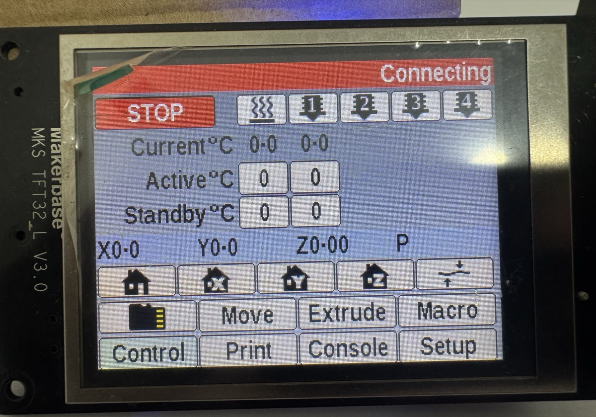

# MKS TFT28 V2.0 / TFT32_L V3.0 — PanelDue Firmware for Klipper / Voron 2.4

> [Versão em Português](README.pt-br.md)



## Hardware

| Item | Value |
|------|-------|
| Board | MKS TFT28 V2.0 (silk screen: MKS TFT32_L V3.0) |
| MCU | STM32F107VCT6 (chipid 0x418, Cortex-M3, 256 KB flash) |
| Display | H685, 320×240, TN normally-white |
| LCD controller | **R61505** (ID=0x1505 read via R00h) |
| Touch | XPT2046 via SPI3 |
| EEPROM | Physical I2C chip (separate from STM32 flash) |
| Protocol | PanelDue (based on robotsrulz/MKS-TFT) |

---

## Flashing

### Hardware required

**ST-Link V2 programmer** — cheap clones (~$5) work fine.

### SWD wiring

Connect the ST-Link to the SWD header on the board (labeled `SWD` or `JTAG`):

| ST-Link | MKS TFT28 |
|---------|-----------|
| SWDIO | SWDIO |
| SWDCLK | SWDCLK |
| GND | GND |
| 3.3V | 3.3V |

> The board must be **powered on** during flashing.

---

### Option A — Windows (STM32CubeProgrammer)

1. Download and install [STM32CubeProgrammer](https://www.st.com/en/development-tools/stm32cubeprog.html) (free, official ST tool)
2. Connect the ST-Link to USB and to the board
3. Open STM32CubeProgrammer → select **ST-LINK** → click **Connect**
4. Go to **Erasing & Programming**
5. Browse to `MKS-TFT32_voron24_klipper.bin`
6. Set start address to `0x08000000`
7. Check **Verify programming** and **Run after programming**
8. Click **Start Programming**

---

### Option B — macOS / Linux (OpenOCD)

Install OpenOCD:
```bash
# macOS
brew install openocd

# Ubuntu/Debian
sudo apt install openocd
```

Run in the folder where the `.bin` file is located:

```bash
openocd -f interface/stlink.cfg -f target/stm32f1x.cfg \
  -c "program MKS-TFT32_voron24_klipper.bin verify reset exit 0x08000000"
```

---

### Option C — From the Klipper Raspberry Pi

If the ST-Link is connected to the Pi's USB port, flash directly from the Pi (no separate computer needed):

```bash
sudo apt install openocd
cd ~
wget https://github.com/rescosta/MKS-TFT/raw/r61505-stm32f107-klipper/binaries/MKS-TFT32_voron24_klipper.bin
openocd -f interface/stlink.cfg -f target/stm32f1x.cfg \
  -c "program MKS-TFT32_voron24_klipper.bin verify reset exit 0x08000000"
```

---

### Expected output (Options B and C)

```
** Programming Started **
** Programming Finished **
** Verify Started **
** Verified OK **
** Resetting Target **
```

If you see `Verified OK`, the board resets automatically and the PanelDue interface appears on the display.

> **Important:** do **not** use `st-flash` directly — it has known issues with the STM32F107 and may report success without actually flashing.

---

## Connecting to Klipper

### 1. Physical wiring

The MKS TFT28 V2.0 has a 4-pin serial connector (TTL 3.3 V) labeled **EXP** or **RS232** on the board:

| TFT28 pin | Signal | Connect to |
|-----------|--------|------------|
| TX | Transmit | RX of Raspberry Pi / SBC |
| RX | Receive | TX of Raspberry Pi / SBC |
| GND | Ground | GND of Raspberry Pi / SBC |
| 5V / 3.3V | Power | (optional — can power from printer connector) |

> **Note:** TX of the TFT goes to RX of the Pi and vice-versa. TTL 3.3 V levels — do **not** connect to a 12 V RS232 port.

#### Option A — Raspberry Pi GPIO UART

Connect TX / RX / GND to the GPIO header:

| Pi GPIO | Physical pin | Function |
|---------|-------------|----------|
| GPIO14 | Pin 8 | TXD (→ TFT RX) |
| GPIO15 | Pin 10 | RXD (← TFT TX) |
| GND | Pin 6 or 14 | GND |

Resulting serial device: `/dev/ttyAMA0` (Pi 3/4) or `/dev/ttyS0`

Enable UART on the Pi if needed:
```bash
# /boot/config.txt
enable_uart=1
dtoverlay=disable-bt   # frees UART0 from Bluetooth (Pi 3/4)
```

#### Option B — USB-TTL adapter

Connect via a USB-to-serial adapter (CP2102, CH340, FTDI). The device will appear as `/dev/ttyUSB0` or similar.

#### Identifying the correct serial port

```bash
ls /dev/tty{USB,AMA,S}*
# or
dmesg | grep tty
```

---

### 2. Moonraker configuration

```ini
# moonraker.conf
[paneldue]
serial: /dev/ttyAMA0      # adjust to your detected device
baud: 57600
machine_name: Voron 2.4
macros:
  LOAD_FILAMENT
  UNLOAD_FILAMENT
confirmed_macros:
  RESTART
  FIRMWARE_RESTART
```

---

### 3. printer.cfg macros

Add to `printer.cfg`:

```ini
# Required for PanelDue beep support
[gcode_macro PANELDUE_BEEP]
gcode:
    
    
    M300 S{FREQUENCY} P{(DURATION * 1000)|int}

# Optional — appear as macro buttons on the PanelDue
[gcode_macro LOAD_FILAMENT]
gcode:
    M83
    G1 E50 F300
    G1 E30 F150
    M82

[gcode_macro UNLOAD_FILAMENT]
gcode:
    M83
    G1 E10 F300
    G1 E-80 F800
    M82
```

> If your printer has no buzzer (`M300`), `PANELDUE_BEEP` can be left empty — the PanelDue works fine without audio.

---

### 4. Restart services

```bash
sudo systemctl restart moonraker
sudo systemctl restart klipper
```

The display should show **"Connecting"** for a few seconds, then show printer data (temperatures, position, etc.).

---

## R61505 register values — final configuration

Values extracted by ARM Thumb-2 disassembly of the original MKS firmware (mkstft28.bin v3.0.2).

### Startup (before R01h)

| Register | Value | Description |
|----------|-------|-------------|
| R0E5h | 0x8000 | R61505 proprietary startup command |
| R00h  | 0x0001 | Start oscillator |

### Power

| Register | Value | Description |
|----------|-------|-------------|
| R10h | 0x17B0 | Power Control 1: SAP=1, BT=7, APE=1 |
| R11h | 0x0037 | Power Control 2: DC1=3, DC0=0, VC=7 |
| R12h | 0x0138 | Power Control 3: VRH=8, PON=1, VCIRE=1 |
| R13h | 0x1700 | Power Control 4: VDV=23 |
| R29h | 0x001F | VCOMH=31 |
| R61h | 0x0001 | REV=1 (inverted LC drive polarity — **critical for vivid colors**) |

> `R61h REV=1` is **not documented** in any public R61505 datasheet. It was found only by disassembly of the original MKS binary and is the key to correct color rendering on the H685 panel.

### Gamma (R30h–R3Dh)

```
R30h=0x0707  R31h=0x0007  R32h=0x0603
R33h=0x0700  R34h=0x0202  (R61505 non-standard, undocumented)
R35h=0x0002
R36h=0x1F0F  (VRP1=31 — maximum gamma amplitude)
R37h=0x0707  R38h=0x0000  R39h=0x0000
R3Ah=0x0707  R3Bh=0x0000  (R61505 non-standard, undocumented)
R3Ch=0x0007  R3Dh=0x0000
```

### Panel interface

```
R90h=0x0010  R92h=0x0000  R93h=0x0003
R95h=0x0101  R97h=0x0000  R98h=0x0000
```

### Display turn-on sequence (R07h)

```
R07h=0x0021 → delay 50 ms → R07h=0x0031 → delay 50 ms → R07h=0x0173
```

### Orientation and BGR

| Parameter | Value |
|-----------|-------|
| DisplayOrientation | ReverseX \| SwapXY (0x03) |
| R01h | SS=0, SM=0 |
| R03h | AM=1, BGR=1 (bit 12), I/D=11 |
| R60h | GS=0, NL=0x27 (320 lines) |

---

## Touch

- Controller: XPT2046 via SPI3
- Default orientation: SwapXY (0x01)
- Calibration saved to EEPROM (magicVal=0x3AB629D7)
- Calibration survives reflashing (EEPROM is not erased by mass erase)

---

## Backlight

- PWM via TIM4_CH3 (PD14), 1 kHz
- AFIO full remap enabled (`__HAL_AFIO_REMAP_TIM4_ENABLE()`)
- Brightness: 100% (`lcd.setBacklightBrightness(100)` in `Src/PanelDue.cpp`)

---

## Building from source

**Toolchain:** `arm-none-eabi-gcc 10.3-2021.10`

```bash
# Build
make

# Flash
make flash
# or
openocd -f interface/stlink.cfg -f target/stm32f1x.cfg \
  -c "program build/MKS-TFT32.bin verify reset exit 0x08000000"
```

**Required Makefile defines:**

```makefile
DEFS = -DSTM32F107xC -DMKS_TFT -DILI9328 -DR61505 -DUSE_HAL_DRIVER
```

---

## Status

| Feature | State |
|---------|-------|
| Display orientation | ✓ Correct |
| Touch | ✓ Working (auto-calibration) |
| Backlight PWM | ✓ Working |
| Klipper communication (PanelDue) | ✓ Configured |
| Color vibrancy | ✓ Vivid colors confirmed |
| Scan lines | ✓ None |
